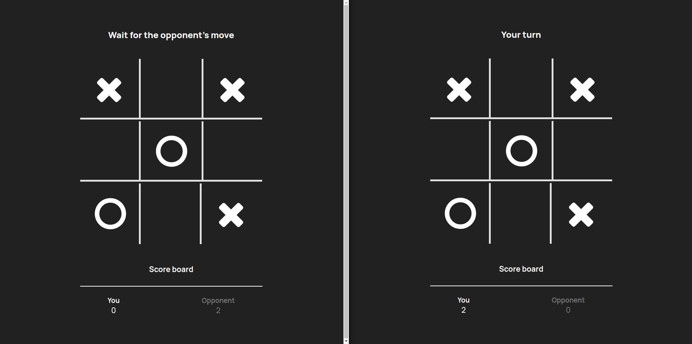
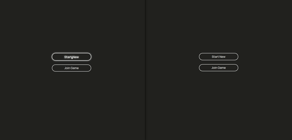

# Tic-Tac-Toe Multiplayer Game

<!-- ## [Watch it live](https://gulevskydev-sorting-visualier.netlify.app/) -->



## You can clone it and run:

```bash
npm install
```

This will start a live-server with the project running. You need to open two terminal windows, one for the server and another for the client-side.

```bash
cd client && npm start
```

```bash
cd server && npm start
```

### How to use :


